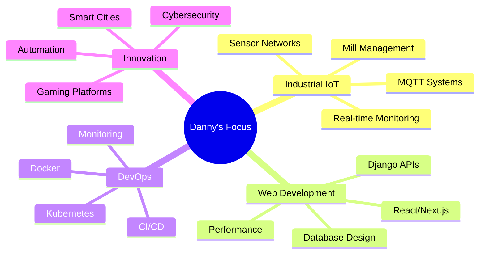

<!-- 
██████╗  █████╗ ███╗   ███╗███╗   ██╗██╗   ██╗    ██╗   ██╗███████╗██████╗ ██╗  ██╗███████╗██╗   ██╗███████╗███╗   ██╗
██╔══██╗██╔══██╗████╗ ████║████╗  ██║╚██╗ ██╔╝    ██║   ██║██╔════╝██╔══██╗██║  ██║██╔════╝╚██╗ ██╔╝██╔════╝████╗  ██║
██║  ██║███████║██╔████╔██║██╔██╗ ██║ ╚████╔╝     ██║   ██║█████╗  ██████╔╝███████║█████╗   ╚████╔╝ █████╗  ██╔██╗ ██║
██║  ██║██╔══██║██║╚██╔╝██║██║╚██╗██║  ╚██╔╝      ╚██╗ ██╔╝██╔══╝  ██╔══██╗██╔══██║██╔══╝    ╚██╔╝  ██╔══╝  ██║╚██╗██║
██████╔╝██║  ██║██║ ╚═╝ ██║██║ ╚████║   ██║        ╚████╔╝ ███████╗██║  ██║██║  ██║███████╗   ██║   ███████╗██║ ╚████║
╚═════╝ ╚═╝  ╚═╝╚═╝     ╚═╝╚═╝  ╚═══╝   ╚═╝         ╚═══╝  ╚══════╝╚═╝  ╚═╝╚═╝  ╚═╝╚══════╝   ╚═╝   ╚══════╝╚═╝  ╚═══╝
-->

<div align="center">
  


</div>

<div align="center">
  
  <!-- Badges -->
  
  
  
  
</div>

---

<h2 align="center">🚀 About Me</h2>


```typescript
const Danny = {
    pronouns: "He" | "Him",
    location: "Belgium 🇧🇪",
    code: ["Python", "JavaScript", "TypeScript", "Rust", "Go"],
    askMeAbout: ["IoT", "DevOps", "Mill Management", "Smart Cities", "Gaming"],
    technologies: {
        frontEnd: {
            js: ["React", "Next.js", "Vue"],
            css: ["Tailwind", "Bootstrap", "Sass"]
        },
        backEnd: {
            python: ["Django", "FastAPI", "Flask"],
            js: ["Node.js", "Express"],
            misc: ["MQTT", "WebSockets", "GraphQL"]
        },
        devOps: ["Docker", "Kubernetes", "GitHub Actions", "Nginx"],
        databases: ["PostgreSQL", "MongoDB", "Redis", "InfluxDB"],
        iot: ["Raspberry Pi", "Arduino", "LoRaWAN", "MQTT"],
        misc: ["Linux", "Git", "Postman", "Figma"]
    },
    currentFocus: "Building Industrial IoT Solutions 🏭",
    funFact: "I debug with console.log() and I'm not ashamed! 😄"
};
```

<br clear="right"/>

---

<h2 align="center">🛠️ Tech Arsenal</h2>

<div align="center">

### 🌐 Frontend
[](./tech-info/react.md)


### ⚙️ Backend & DevOps


[](./tech-info/docker.md)


### 🗄️ Databases & Cloud
[](./tech-info/postgresql.md)


### 🤖 IoT & Hardware
[](./tech-info/raspberry-pi.md)


[](./tech-info/lorawan.md)

</div>

---

<h2 align="center">📊 GitHub Analytics</h2>

<div align="center">
  
  
</div>

<div align="center">
  
</div>

<div align="center">
  
</div>

---

<h2 align="center">🏆 Achievements & Trophies</h2>

<div align="center">
  
</div>

<div align="center">
  
  ### 🎯 My Journey in Numbers
  
  
  
  
  
  
</div>

---

<h2 align="center">🚀 Featured Projects</h2>

<div align="center">

<table>
<tr>
<td width="50%">

### 🏭 Mill Management System
[](https://github.com/Jjustmee23/mill-management-system)

**Complete industrial mill management with Django & MQTT**
- 🐳 Docker containerized
- 📊 Real-time monitoring
- 🔧 IoT integration
- 📱 Mobile responsive


</td>
<td width="50%">

### 🎮 Gaming Community Platform
[](https://github.com/Jjustmee23/gamecom)

**Social platform for gamers with real-time features**
- ⚡ Real-time chat
- 🏆 Tournament system
- 👥 Community features
- 🎯 Gaming stats


</td>
</tr>
<tr>
<td width="50%">

### 🔒 CyberShieldX
[](https://github.com/Jjustmee23/CyberShieldX)

**Advanced cybersecurity toolkit**
- 🛡️ Security scanning
- 🔍 Vulnerability assessment
- 📋 Compliance reporting
- 🚨 Threat detection


</td>
<td width="50%">

### 🐳 Docker Platforms
[](https://github.com/Jjustmee23/docker-platforms)

**Containerized development environments**
- 🚀 Quick deployment
- 🔧 Multiple stacks
- ⚙️ Auto-scaling
- 📊 Monitoring included


</td>
</tr>
</table>

</div>

---

<h2 align="center">🌟 Specialized Skills</h2>

<div align="center">

### 🏭 Industrial IoT & Automation
```
🔹 Mill Management Systems     ████████████████████ 100%
🔹 MQTT Communication         ███████████████████  95%
🔹 Sensor Integration         ██████████████████   90%
🔹 Real-time Monitoring       ███████████████████  95%
🔹 Industrial Protocols       ████████████████     80%
```

### 💻 Web Development
```
🔹 Full-Stack Development     ███████████████████  95%
🔹 React/Next.js              ██████████████████   90%
🔹 Django/Python              ████████████████████ 100%
🔹 Database Design            ███████████████████  95%
🔹 API Development            ██████████████████   90%
```

### ☁️ DevOps & Infrastructure
```
🔹 Docker/Containerization    ███████████████████  95%
🔹 CI/CD Pipelines            ██████████████████   90%
🔹 Cloud Deployment           █████████████████    85%
🔹 System Administration      ██████████████████   90%
🔹 Monitoring & Logging       █████████████████    85%
```

</div>

---

<h2 align="center">🐍 Contribution Snake</h2>

<div align="center">
  
</div>

---

<h2 align="center">🎯 Current Focus</h2>

<div align="center">



</div>

---

<h2 align="center">📈 Coding Activity</h2>

<div align="center">

<!--START_SECTION:waka-->
<!--END_SECTION:waka-->

### 📅 This Week I Spent My Time On:
```text
Python       █████████████████████░   85.2%
JavaScript   ██████░░░░░░░░░░░░░░░░░   12.1%
Docker       ██░░░░░░░░░░░░░░░░░░░░░    2.1%
YAML         █░░░░░░░░░░░░░░░░░░░░░░    0.6%
```

</div>

---

<h2 align="center">🤝 Let's Connect & Collaborate</h2>

<div align="center">

[](https://www.linkedin.com/in/danny-verheyen-493862220/)
[](https://github.com/Jjustmee23)
[](mailto:danny.verheyen@outlook.com)
[](https://discord.gg/yourusername)

### 💡 Open to Collaborate On:
- 🏭 **Industrial IoT Projects** - Smart factory solutions
- 🌐 **Full-Stack Applications** - Modern web platforms  
- 🤖 **Automation Systems** - Streamline processes
- 🎮 **Gaming Platforms** - Community-driven applications
- 🔒 **Cybersecurity Tools** - Secure the digital world

</div>

---

<h2 align="center">🎊 Fun Zone</h2>

<div align="center">

### 😄 Daily Dose of Humor


### 💭 Inspirational Quote


### 🎵 Currently Vibing To
[](https://open.spotify.com/user/yourusername)

</div>

---

<div align="center">

### 🌟 Thank you for visiting! 🌟


**"The best way to predict the future is to invent it."** - Alan Kay

[](https://skyline.github.com/Jjustmee23/2024)

---

*Last updated: December 2024*

</div>